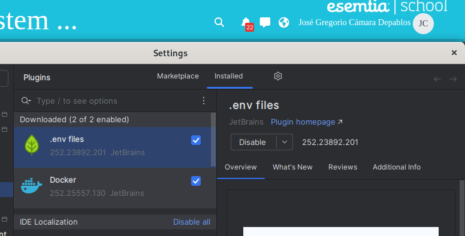
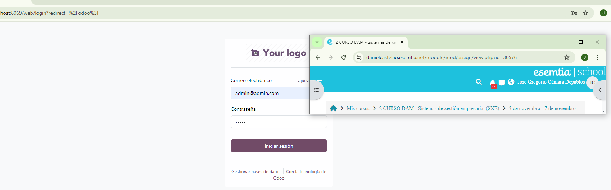
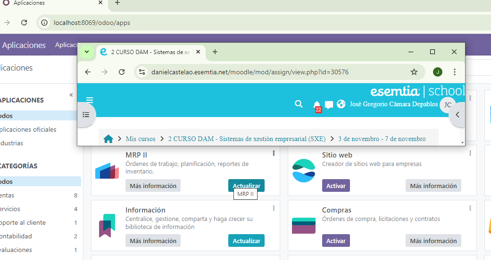
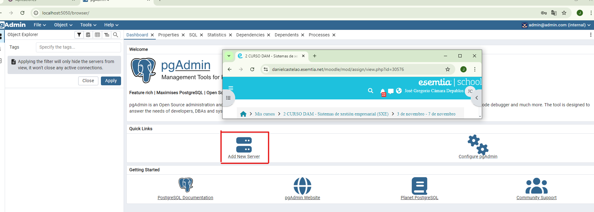
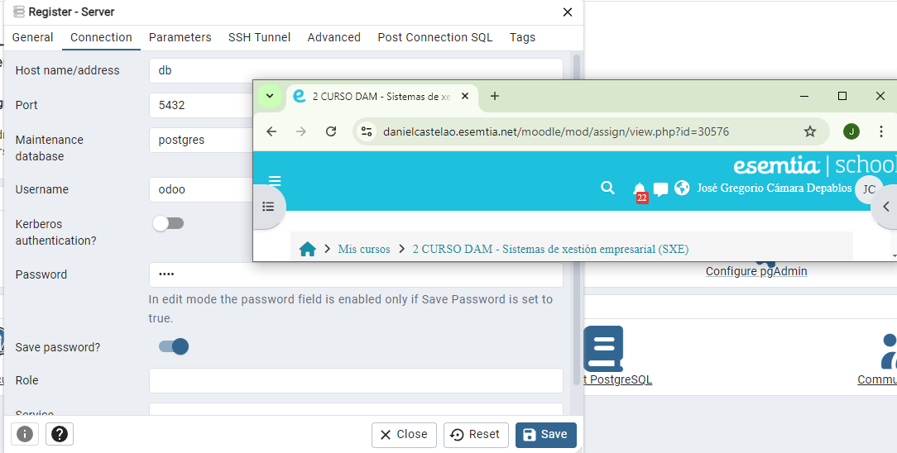
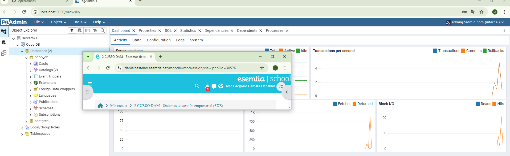
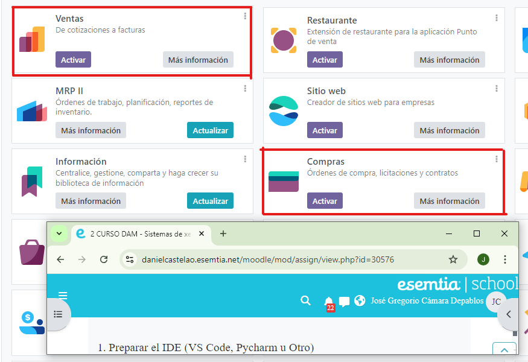
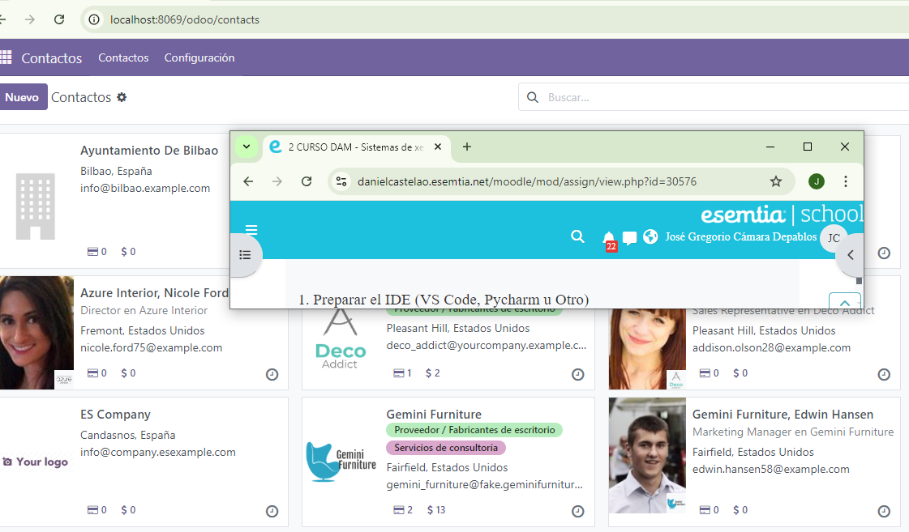
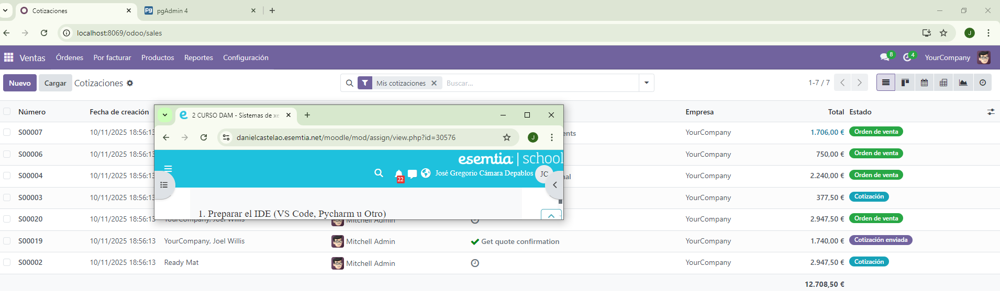
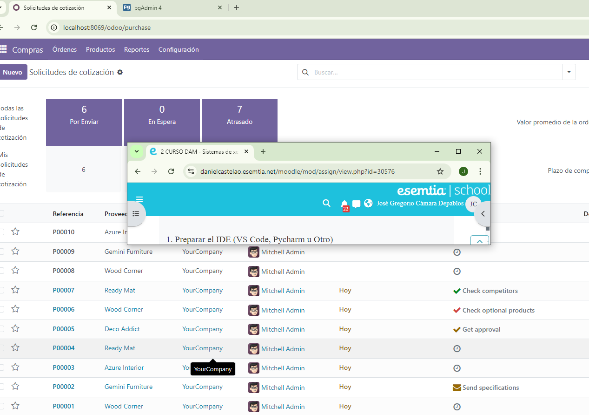

# Instalación de ERP Odoo con la herramienta Docker Compose

En este README utilizaremos la herramienta Docker Compose para crear un varios contenedores y poner en marchar un servicio de Odoo con un solo archivo YML.

<br><br>

## Preparación de el ejercicio:

<details><summary><h3>Instalación y puesta en marcha del IDE PyCharm</h3></summary>
  
  Se realizó la instalación de PyCharm y se instalaron los siguientes Plugins: 
  <br><br>
  
  <br><br>
  

  | Plugin        | Descripción                                                                                          |
   | ------------------- | ----------------------------------------------------------------------------------------------------- |
   | Docker               | Plugin que facilita la gestión de contenedores y compose. |
   | .env files           | Plugin que realiza autollenado de variables de entornos utilizadas en tu archivo .env                                      |

Como se puede observar en la siguiente imagen, el plugin de Docker autocompleta su lenguaje de marcado:
 

</details>

<details><summary><h3>Creación del archivo docker-compose.yml</h3></summary>
  
  Para poner en marcha el ERP creamos el siguiente docker-compose con los siguientes contenedores: 
  <br><br>
  
  <br><br>
  Aquí listamos las distintas variables de entorno necesarias para correr los 3 servicios que utilizaremos:
  
  | Variable        | Valor                | Descripción                                                                     |
   | ------------------- | ------------------------- | ---------------------------------------------------------------------- |
   | HOST               | db                         | Especifica cual es el anfitrión de la base de datos del servicio Odoo. |
   | USER                | odoo                        | Especifica el usuario administrador de la app Odoo.  |
   | PASSWORD            | odoo                    | Esta variable indica la clave del usuario administrador. |
   | POSTGRES_USER        | odoo                   | Esta variable indica el usuario de la base de datos. |
   | POSTGRES_PASSWORD     | odoo                     | Indica la clave principal de la base de datos. |
   | POSTGRES_DB               | postgres            | indica la base de datos que se va a crear automáticamente. |
   | PGADMIN_DEFAULT_EMAIL       | admin@admin.com    | Esta variable especifíca el usuario de PgAdmin. |
   | PGADMIN_DEFAULT_PASSWORD    | admin1234         | Esta variable especifíca la clave del usuario de PgAdmin. |
   
  <br><br>
  Para iniciar el compose utilizaremos el siguiente comando en la terminal en la ruta donde se encuentre el archivo .yml:
  ```bash
docker compose up -d
```
  Se verifica que los servicios estén funcionando en Docker Desktop:
  <br><br>
  
  <br><br>
  
</details>

<details><summary><h3>Puesta en marcha de servicio Odoo y su Base de Datos</h3></summary>
  
  - Ya los servicio funcionando lo primero es ingresar en Odoo a traves del localhost:8069(en este caso porque es el puerto asignado) : 
  <br><br>
  
  <br><br>
  - Vamos a rellenar todos los datos necesarios para crear la base de datos de Odoo (recordar el nombre de la base de datos porque se utilizará porteriormente para ingresar a PgAdmin)
  - Mantener marcado la casilla "Demo Data" para demostraciones posteriores.
  <br><br>
  
  <br><br>
  - Ingresamos a la pagina principal de nuestra empresa utilizando el usuario y contraseña que acabamos de realizar en el paso anterior:
  <br><br>
  
  <br><br>
  - Verificamos la pagina principal
  
</details>

<details><summary><h3>Configuración del servicio PgAdmin</h3></summary>
  
  - Ya realizado la base de datos de Odoo con anterioridad, ingresamos a el servicio de PgAdmin a través de Localhost:5050(para este caso es 5050 el puerto configurado)
  -  Ingresamos con los datos que colocamos en las variables de entorno PGADMIN_DEFAULT_EMAIL y PGADMIN_DEFAULT_PASSWORD:
  <br><br>
  
  <br><br>
  -  En "Dashboard" pinchamos Add New Server:
  <br><br>
  
  <br><br>
  -  En la pestaña "General" escribimos en Name el nombre que queremos darle a la base de datos:
  <br><br>
  
  <br><br>
  -  En la pestaña "Connection" se tienen que rellenar los siguientes espacios:

  | Casilla              | Valor                      | Descripción                                                                                          |
   | ------------------- | ------------------------- | ----------------------------------------------------------------------------------------------------- |
   | Host name/address   | db                      | En esta casilla se coloca el nombre que asignamos al contenedor de la base de datos postgres (en este caso db)  |
   | Port                | 5432                       | Las base de datos por defecto se asignan en el puerto 5432.                                          |
   | Username            | odoo                       | Aqui colocamos el valor que escribimos en la variable de entorno POSTGRES_USER                        |
   | Password            | odoo                       | Aqui colocamos el valor que escribimos en la variable de entorno POSTGRES_PASSWORD                    |

  <br><br>
  
  <br><br>
  - Pinchamos "Save"
  <br><br>
  
  <br><br>
  Base de datos ya visible desde el gestor PgAdmin.

</details>

<details><summary><h3>Puesta en marcha de Odoo (con datos de demostración)</h3></summary>
  
  - Lo primero será desde la tienda descargar los módulos Ventas, Compras y Contactos: 
  <br><br>
  
  <br><br>
  - Capturas de los distintos módulos descargados funcionando con los datos de demostración:
  <br><br>
  
  <br><br><br><br>
  
  <br><br><br><br>
  
  <br><br>

</details>

## Contacto
José Gregorio Cámara Depablos - [@CabbaGG](https://x.com/Geek_Cabagge) - JOS.95camara@gmail.com

Project Link: ([Instalación de ERP Odoo con Docker Compose](https://github.com/CabbaGG2/SXE_Tarea11_Instalaci-nOdoo))

## Documentación

* [Documentación de Docker](https://docs.docker.com/get-started/)
* [Documentación de Postgres](https://hub.docker.com/_/postgres)
* [Documentación de PgAdmin](https://hub.docker.com/r/dpage/pgadmin4)
* [Documentación de Odoo](https://hub.docker.com/_/odoo)
